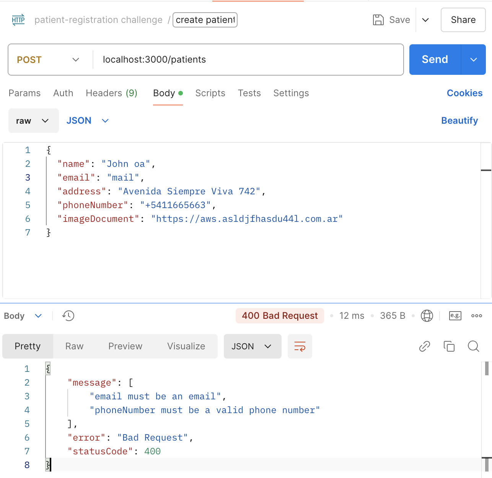
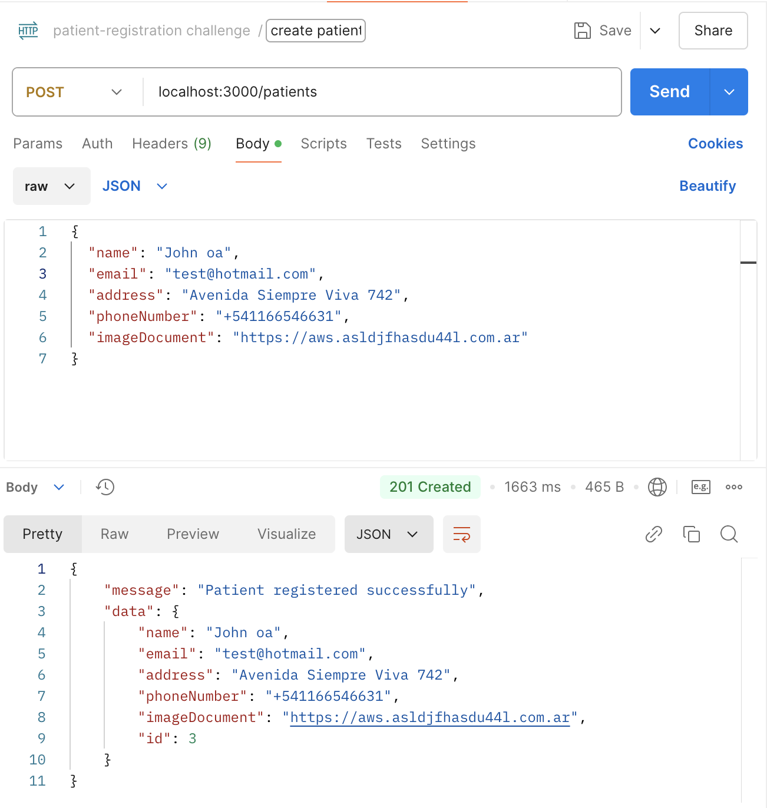
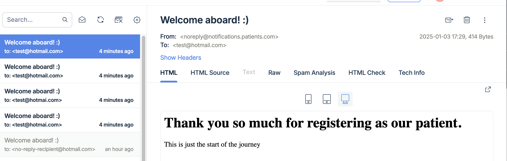

<h2> Light-it Challenge ⚡  Patient registration</h2>

## 💡 Overview

An API for patient registration that collects the following information: name, email address, phone number, and a photo of the document.

## 👩‍💻 Tech Stack

- **💾 Storage:** MySQL Database and TypeORM for mapping.
- **🌍 Containerization:** Docker.
- **📬 Notification e-mail:** nodemailer. Send automatic email once registered with option to scale to other types of notification using Design Patterns.
- **📄 API Documentation:** Swagger.

### 📃 API Documentation

The API documentation for this application is available at [http://localhost:3000/api/docs](http://localhost:3000/api). It details all endpoints and their usage.

## 🧪 Test Cases

1. **Invalid Input.**
   
2. **Register patient successfully.**
   
3. **Register patient successfully and email confirmation sent.**
   
